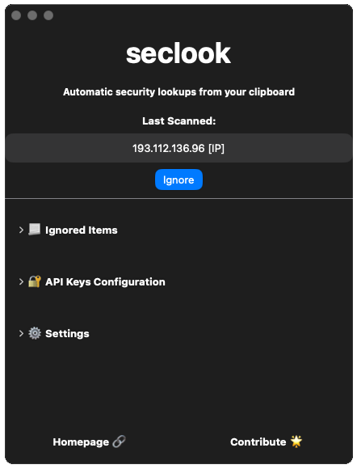
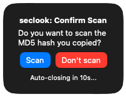

# seclook

#### Automatic security lookups from your clipboard

seclook is a macOS/Swift app that sits in the background and monitors your clipboard, sending any IP, SHA2/MD5 hash, or domain to VirusTotal and AbuseIPDB. If any scanned item has a bad reputation score, you get a notification!

## Features

* Automatically scan your clipboard for the following string types:
  * IP addresses
  * SHA2 hashes
  * MD5 hashes
  * Domains
* A confirmation alert window will always show before sending SHA2 and MD5 hashes
* Receive notifications through macOS Notification Center when a scanned item has a bad reputation score
* Send scanned items to the following security lookup services:
  * VirusTotal
  * AbuseIPDB
* Add known-good items to an Ignore List
* Toggle scanning on/off:
  * Universally using menu bar icon
  * By string type

## Installation

Download the latest Mac release [**here**](https://github.com/ackatz/seclook/raw/main/Releases/seclook.dmg). 

To start the app automatically at start up, add it to the "Open at Login" list in Settings > Login Items

## Contributions

I'm happy to merge contributions that fit my vision for the app (simple, background app). Bug fixes and more tests are always welcome.

## FAQ

### Are you planning to release seclook for any other platforms?

No, at the moment this is out of scope, sorry.

### What does seclook send from my clipboard to lookup services?

seclook only sends the regex'ed string that was found (e.g., a single IP address such as `1.1.1.1`). No other data from the clipboard ever leaves your computer.

### What does seclook do if I copy a password?

To protect against sending passwords to lookup services, seclook will always ask you before sending SHA2 and MD5 hashes to lookup services.

#### A note on Password Managers

##### Autofill

seclook does not detect username/password combinations that are input from **auto fill** functions.

##### Desktop Apps + Manual Copy

If you manually copy any value from a password manager **desktop app** that sets `org.nspasteboard.ConcealedType` (see [NSPasteboard](http://nspasteboard.org/)) for copied data (i.e., 1Password Desktop app), seclook will ignore the clipboard value.

##### Browser Extensions + Manual Copy

If you manually copy from a password manager **browser extension**, there is not currently a way to detect `org.nspasteboard.ConcealedType` in this case. seclook will still prompt you to confirm before sending any regex'ed hash values to lookup services.

## Thanks

* [VirusTotal](https://www.virustotal.com/) and [AbuseIPDB](https://www.abuseipdb.com/) for their awesome APIs
